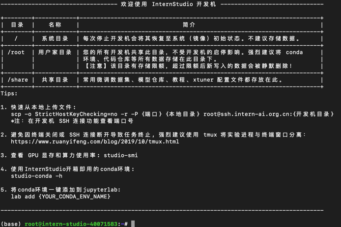
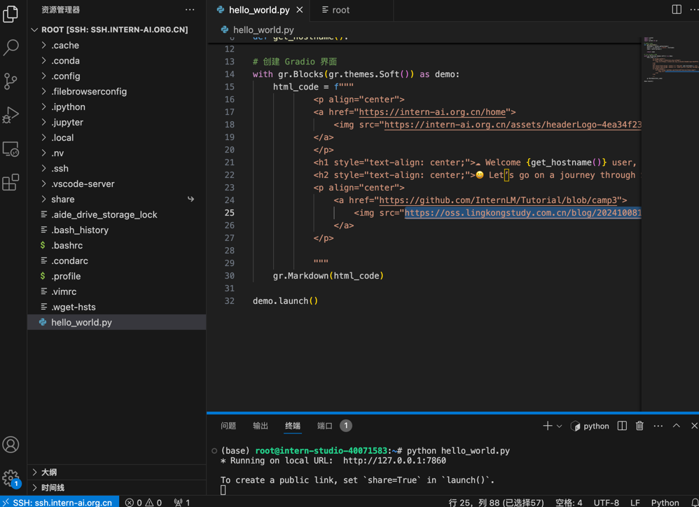

|            | 任务描述                                      | 完成所需时间 |
| ---------- | --------------------------------------------- | ------------ |
| 闯关任务   | 完成SSH连接与端口映射并运行`hello_world.py`   | 10min        |
1. 建立SSH链接   

2. 映射端口 7086，运行 hello_world.py  

