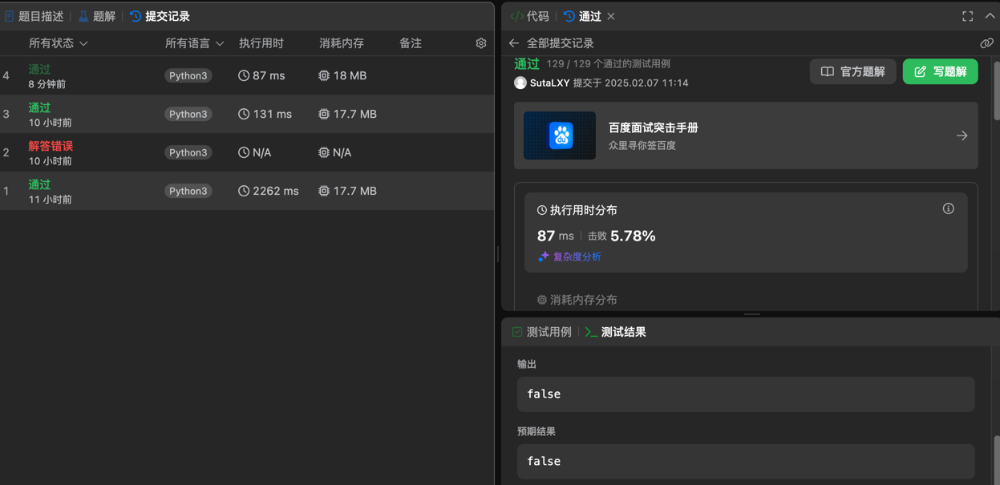
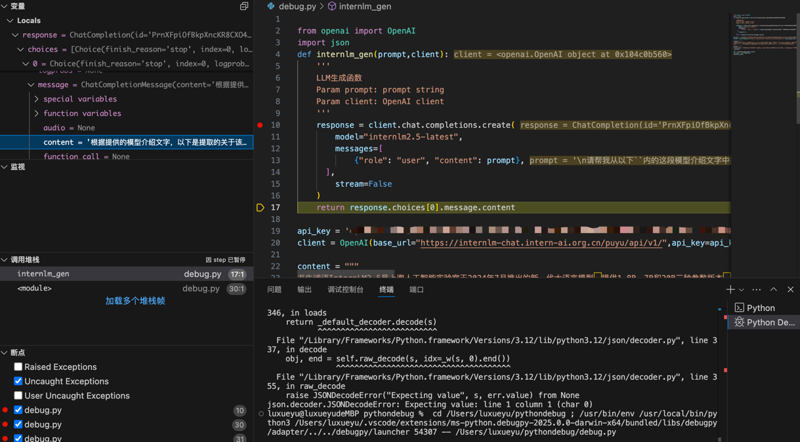
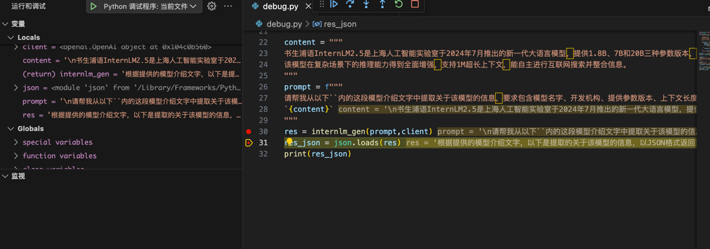
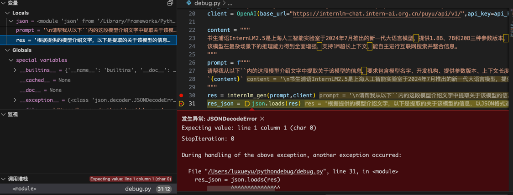

| 任务类型 | 任务内容 | 预计耗时 |
| --- |---| ---|
|闯关任务|Leetcode 383(笔记中提交代码与leetcode提交通过截图)| 20mins|
|闯关任务| Vscode连接InternStudio debug笔记 | 10mins|

## 任务一
笔记中提交代码与leetcode提交通过截图
代码：

    class Solution:
    def canConstruct(self, ransomNote: str, magazine: str) -> bool:
        ransomNotelist=list(ransomNote) 
        magazinellist=list(magazine)
    
        for i in range(96,123):
            if ransomNotelist.count(chr(i))>magazinellist.count(chr(i)):
                return False
        
        return True

leecode通过截图如下：

三次正确提交思路依次为：
1. 依次计算ransomNote中每个字母出现次数，并与magzine中对应字母出现次数进行比较。时间复杂度为n^2。
2. 依次计算ransomNote中26个字母出现次数，并与magzine中对应字母出现次数进行比较。时间复杂度为n。
3. 依次计算ransomNote中26个字母出现次数，并只将ransomNote中出现过的字母与magzine中对应字母出现次数进行比较。时间复杂度为n。

## 任务二
Vscode连接InternStudio debug笔记
1.设置断点后分步执行，确认函数执行无问题，正常返回了结果

2.查看res值无问题

3.执行读取json值操作时出现问题，可能原因为json为空值（已排除）或格式错误
