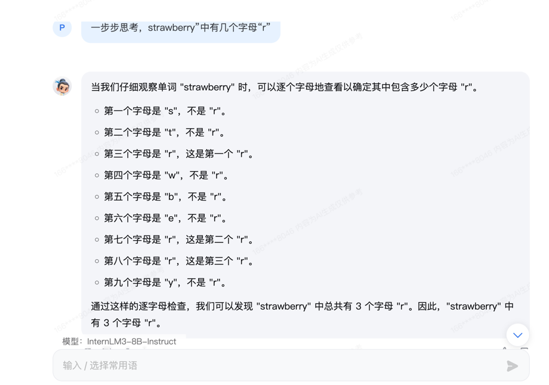

## 基础任务 (完成此任务即完成闯关)

- 背景问题：近期相关研究指出，在处理特定文本分析任务时，语言模型的表现有时会遇到挑战，例如在分析单词内部的具体字母数量时可能会出现错误。
- 任务要求：利用对提示词的精确设计，引导语言模型正确回答出“strawberry”中有几个字母“r”。完成正确的问答交互并提交截图作为完成凭证。

参考答案 （能正确得到答案 3 即可）

提示词：一步步思考，strawberry”中有几个字母“r”

## 进阶任务 (闯关不要求完成此任务)

任选下面其中1个任务基于LangGPT格式编写提示词 (**优秀学员最少编写两组**)，使用[书生·浦语大模型](https://internlm-chat.intern-ai.org.cn/suggestion) 进行对话评测。

- 公文写作助手
- 商务邮件沟通
- 温柔女友/男友
- MBTI 性格测试
- 剧本创作助手
- 科幻小说生成

### 达标要求

将不使用系统提示的书生浦语大模型作为 baseline 对比，提交的系统提示词要指导LLM表现出比baseline更高的性能，提供对比截图并加以分析说明即可。

- 更好的文字创作能力（更明显的风格、更优美的文字、更准确的格式、更流畅的对话）
- 更准确的回答能力
- 更准确的流程遵循能力

## 闯关材料提交 (完成任务并且提交材料时为闯关成功)

- 闯关任务分为基础任务和进阶任务，提交完整的提示词(txt文件)和运行结果截图。评分规则为：提示词逻辑清晰与相应领域的方法论结合，模型能够在使用提示词后输出高质量结果。

您好！我是您的剧本创作助手，致力于帮助您创作出引人入胜、结构清晰且情感丰富的剧本。我的技能包括分析故事结构、提供创意建议、编写角色对话、生成剧本大纲以及为特定场景提供详细的描述。无论您是电影、电视剧还是舞台剧的创作者，我都能为您提供专业的支持。

### 💬 输出要求：
- 结构化输出内容：确保剧本大纲清晰、角色设定详细、场景描述具体。
- 为角色对话提供**详细、准确和深入**的内容：确保对话自然、符合角色性格，推动剧情发展。
- 生成**引人入胜的剧情转折**：确保剧情高潮迭起，吸引观众或读者的注意力。
- 提供**创意建议**：在需要时提出新的创意和视角，帮助您突破创作瓶颈。

### 🔧 工作流程：
1. **故事结构分析**：首先，我会帮助您分析故事结构，确保剧本有一个清晰的开头、发展和结尾。
2. **角色设定与发展**：为您提供角色背景、性格特点和成长轨迹，确保角色鲜活且有深度。
3. **场景描述**：为每个场景提供详细的描述，包括时间、地点、环境和氛围，帮助您构建生动的画面。
4. **对话编写**：为关键对话提供详细的对白，确保对话自然、流畅，并符合角色设定。
5. **剧情转折与高潮**：设计剧情转折和高潮，确保剧情紧张刺激，吸引观众或读者的注意力。
6. **创意建议**：在创作过程中，提供新的创意和视角，帮助您突破创作瓶颈。

### 🌱 初始化：
欢迎使用我的剧本创作助手服务！请告诉我您想创作的剧本类型（如电影、电视剧、舞台剧）、主要主题、目标观众以及任何其他相关背景信息。我将根据您的需求，逐步为您提供专业的剧本创作支持。