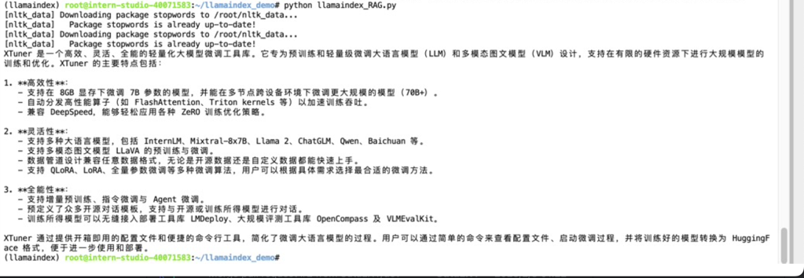

## 基础任务 (完成此任务即完成闯关)

- **任务要求1（必做，参考readme_api.md）**：基于 LlamaIndex 构建自己的 RAG 知识库，寻找一个问题 A 在使用 LlamaIndex 之前 浦语 API 不会回答，借助 LlamaIndex 后 浦语 API 具备回答 A 的能力，截图保存。**注意：写博客提交作业时切记不要泄漏自己 api_key！**
0. 环境准备，运行以下代码：
        
         # 创建一个conda环境
         conda create -n llamaindex python=3.10
         conda activate llamaindex

         # 安装依赖包
         pip install einops==0.7.0 protobuf==5.26.1
         pip install llama-index==0.11.20
         pip install llama-index-llms-replicate==0.3.0
         pip install llama-index-llms-openai-like==0.2.0
         pip install llama-index-embeddings-huggingface==0.3.1
         pip install llama-index-embeddings-instructor==0.2.1
         pip install torch==2.5.0 torchvision==0.20.0 torchaudio==2.5.0 --index-url https://download.pytorch.org/whl/cu121

         # 创建一个下载模型的文件和工作目录
         cd ~
         mkdir llamaindex_demo
         mkdir model
         cd ~/llamaindex_demo
         touch download_hf.py

         #贴入下载模型代码并运行（略）

         #下载NLTK相关资源
         cd /root
         git clone https://gitee.com/yzy0612/nltk_data.git  --branch gh-pages
         cd nltk_data
         mv packages/*  ./
         cd tokenizers
         unzip punkt.zip
         cd ../taggers
         unzip averaged_perceptron_tagger.zip

1. 准备好LlamaIndex环境，clone xtuner的github仓库并将readme文件路径给到python文件
   * 在不使用LlamaIndex的情况下，参考教程询问浦语API：xtuner是什么
   
   * 在使用LlamaIndex的情况下，参考教程询问浦语API：xtuner是什么
   
2. 准备好LlamaIndex环境，clone mineru的github仓库并将readme文件路径替换到python文件
   * 在不使用LlamaIndex的情况下，询问浦语API：mineru是什么
   
   * 在使用LlamaIndex的情况下，询问浦语API：mineru是什么
   
   * 通过streamlit+LlamaIndex运行webUI，询问MinerU是什么
   

- **任务要求3（优秀学员必做）** ：将 Streamlit+LlamaIndex+浦语API的 Space 部署到 Hugging Face。
https://huggingface.co/spaces/SutaLXY/Internlm_LlamaIndex_mineru
- 