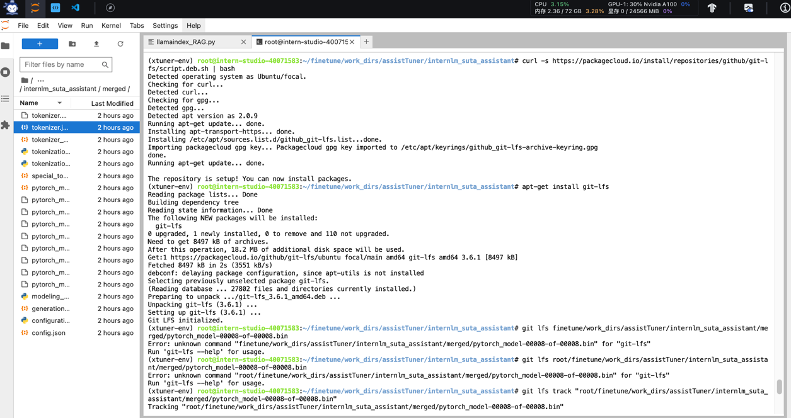
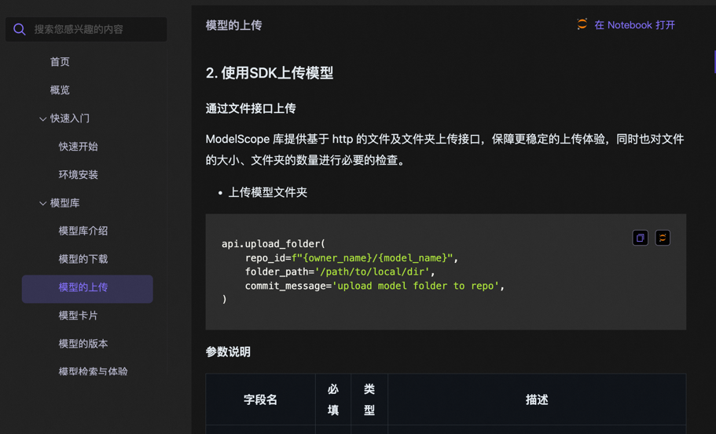
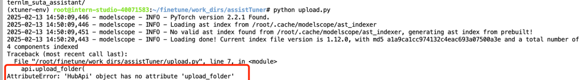
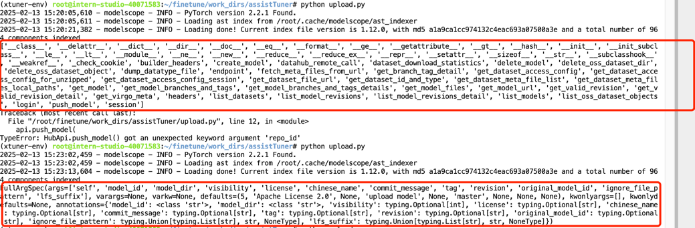

## 基础任务（完成此任务即完成闯关并获得 100 算力点）
使用 XTuner 微调 InternLM2-Chat-7B 实现自己的小助手认知(webUI)，如下图所示（图中的尖米需替换成自己的昵称），记录复现过程并截图。

1. 构建一个 Python-3.10 的虚拟环境并安装XTuner后，通过xtuner list-cfg命令，验证是否能打印配置文件列表。

2. 创建修改脚本，把模型认知的名字修改成自己的名字，执行脚本后可以看到，"Suta"的名字已经出现在数据中了

3. 获取官方写好的 config，按教程修改，修改后保存，就开始微调了

4. 微调好的模型，streamlit中间遇到点问题，因为我同时在运行其他终端，也启了streamlit的任务，而且之前没有意识到需要把之前的进程关掉（比较小白ORZ），不然端口号被占用的话，会一直从8501往上递增。发现端口号已经递增到8506后，我把其他的进程关掉，重启了下，就回到了8501。

5. 本地进行端口映射后，就能成功打开会话的webui页面，这时候问它是谁，已经会回答是我的小助手了。

## 进阶任务（闯关不要求完成此任务）
将自我认知的模型上传到 HuggingFace/Modelscope/魔乐平台，模型名称中包含internlm关键词 (优秀学员必做)，并将应用部署到 HuggingFace/Modelscope/魔乐平台(此处可选)。
参与社区共建，获取浦语 api 创建自己的数据用于微调（有创意的成果有机会获得优秀学员提名）
1. 安装Git LFS扩展，跟踪需要使用 Git LFS 管理的大文件。但是试了几次都断连502了，于是换用了魔搭官方比较推荐的SDK进行上传

2. 但是也遇到了问题，明明是官方推荐的上传文件的方法，调用的时候提示不存在

3. 于是print了包含的函数、函数对应的参数，修改使用了“push_model”函数，成功上传了模型（后来又试了下指定安装了最新版本pip install -U modelscope，是有官方推荐的函数的）

3. 成功上传到Modelscope
https://modelscope.cn/models/SutaLXY/internlm_suta_assistant/files  
