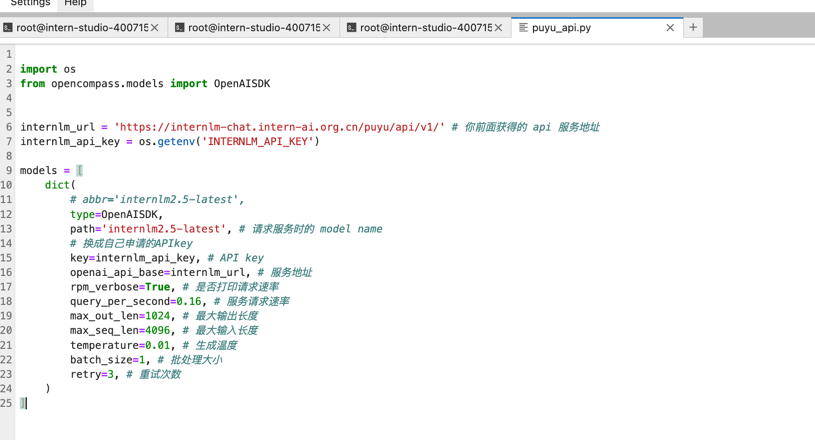
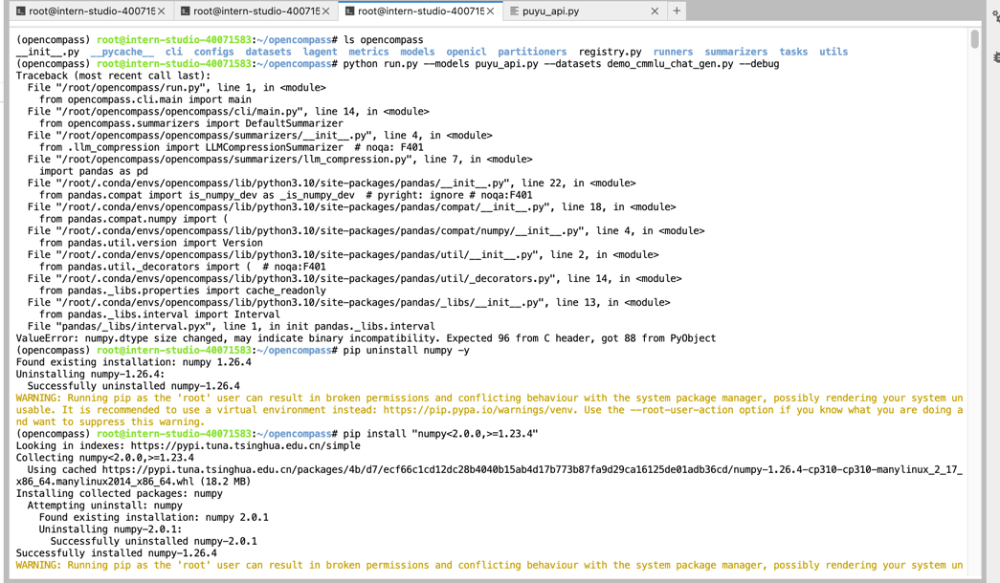
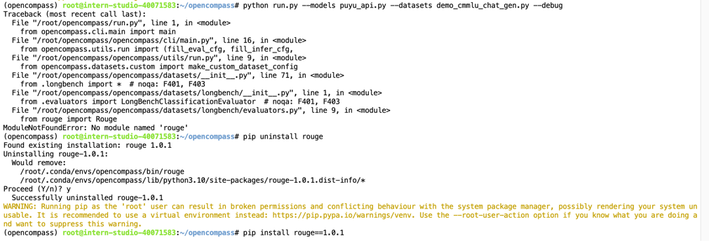
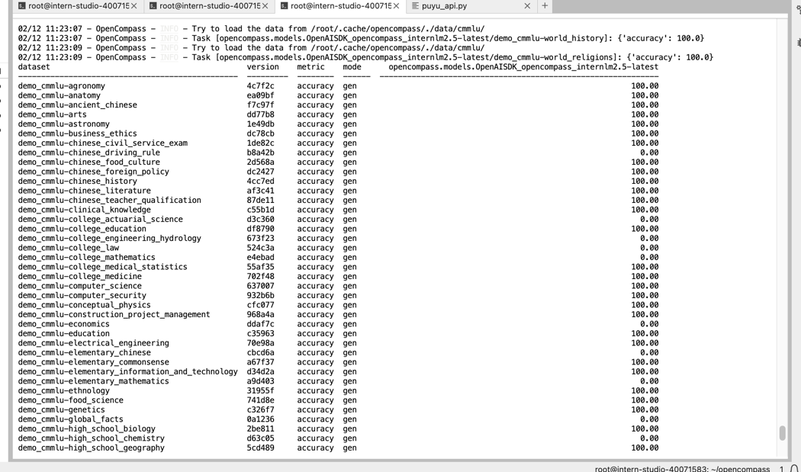
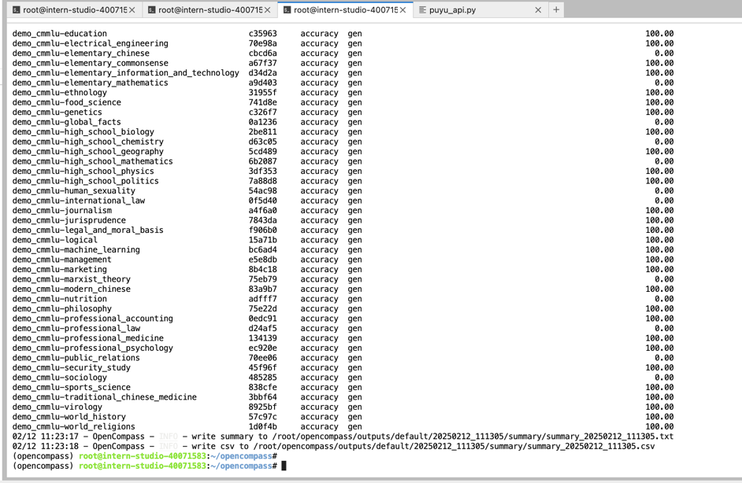

## 基础任务（完成此任务即完成闯关）

- 使用 OpenCompass 评测浦语 API 记录复现过程并截图。（注意：写博客提交作业时切记删除自己的 api_key！）
1. 按照教程创建用于评测 conda 环境，并clone下OpenCompass的仓库
  
          conda create -n opencompass python=3.10
          conda activate opencompass
            
          cd /root
          git clone -b 0.3.3 https://github.com/open-compass/opencompass
          cd opencompass
          pip install -e .
          pip install -r requirements.txt
          pip install huggingface_hub==0.25.2
            
          pip install importlib-metadata
2. 配置OpenCompass及评测参数

2. 运行 python run.py --models puyu_api.py --datasets demo_cmmlu_chat_gen.py --debug ，报错，目测是numpy版本问题，看到教程评测本地模型时为了解决兼容问题需要卸载重装numpy，于是照做

3. 报错，这次是rouge版本问题，于是卸载重装rouge

4. 成功执行，测评结果截图如下：

