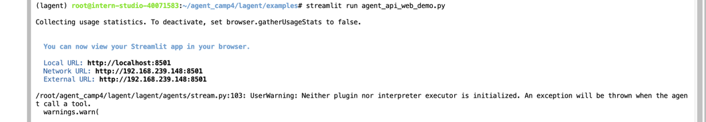
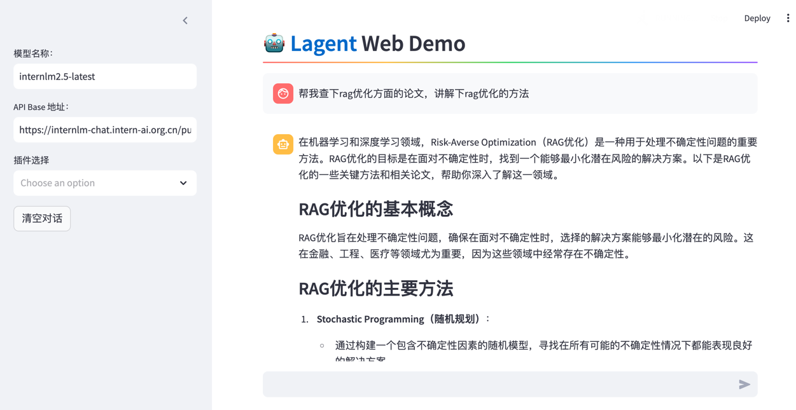
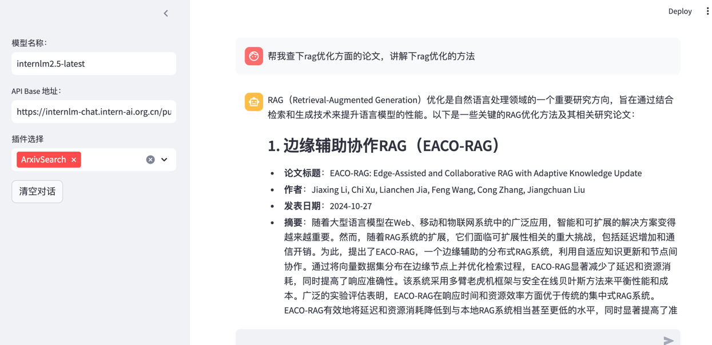
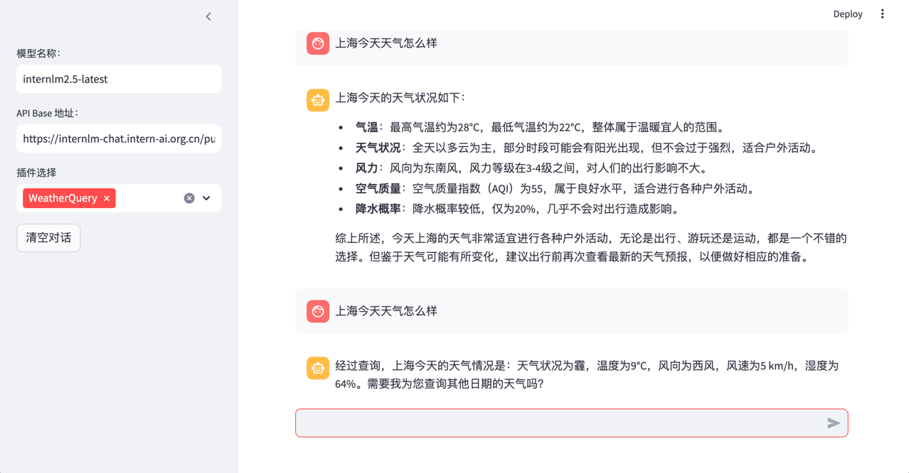
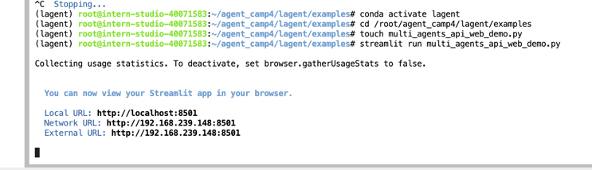
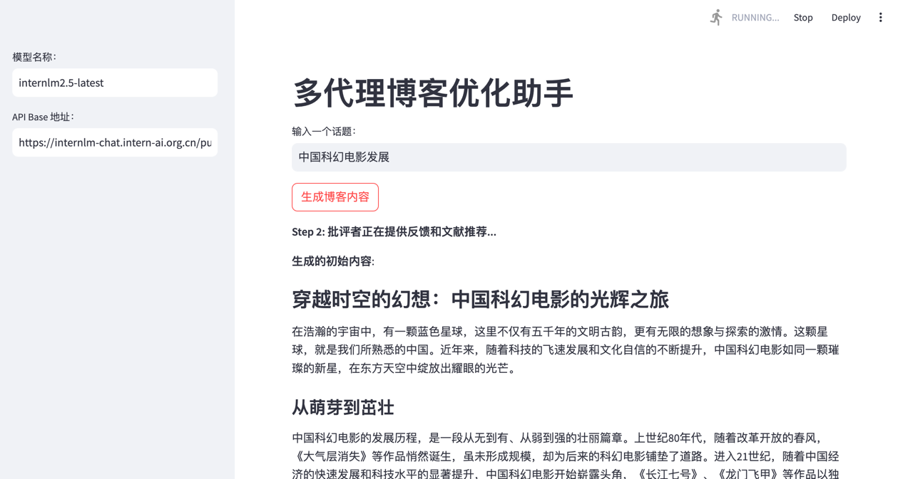
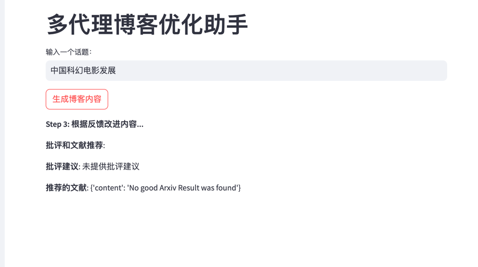
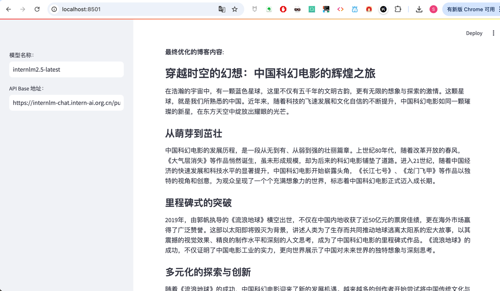
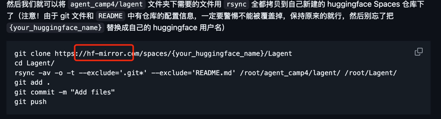

记录复现过程并截图

## **任务（完成此任务即完成闯关）**

### 使用 Lagent 复现文档中 “制作一个属于自己的Agent” 和 “Multi-Agents博客写作系统的搭建”两部分内容，记录复现过程并截图。

1. 复现文档中 “制作一个属于自己的Agent”
   1. 下载配置Lagent环境，按教程新建运行ArxivSearch这个agent
   
   2. 不选中ArxivSearch的情况下，询问“帮我查下rag优化方面的论文，讲解下rag优化的方法”。模型开始胡说八道，说RAG优化的目标是面对不确定性时，找到一个最小化风险的解决方案
   
   3. 选中ArxivSearch的情况下，问同样的问题，模型给出了RAG正确的概念，和一些包括摘要的论文
   
   4. 增加天气的agent配置、参考教程复制相关的代码。在选中、不选中天气agent的情况下，对比回答。未选中的情况下给出了详实丰富的错误答案。选中的情况下，给出了比较标准格式的正确答案。
   

2. 复现文档中“Multi-Agents博客写作系统的搭建”
    1. 参考教程复制多代理博客优化助手的代码，并用streamlit框架部署。
    
    2. 输入“中国科幻电影发展”，可以看到模型分布进行生成初始文本，并进行第二步，批评者提供反馈和文献推荐
   
   3. 可以看到本次第二步中未提供批评建议，也未找到好的论文结果
   
   4. 最终生成的结果
   

### 将你的Agent部署到 Hugging Face 或 ModelScope 平台，应用名包含 Lagent 关键词

已部署：https://huggingface.co/spaces/SutaLXY/internlm_lagent
- 中间参考教程，本来想直接git push到Hugging Face，但是发现网络条件不支持。教程里clone的是hf-mirror镜像的仓库，应该也没法直接push到hugging face上吧。agent文件比较小，所以我是用了笨办法，直接上传的文件。

