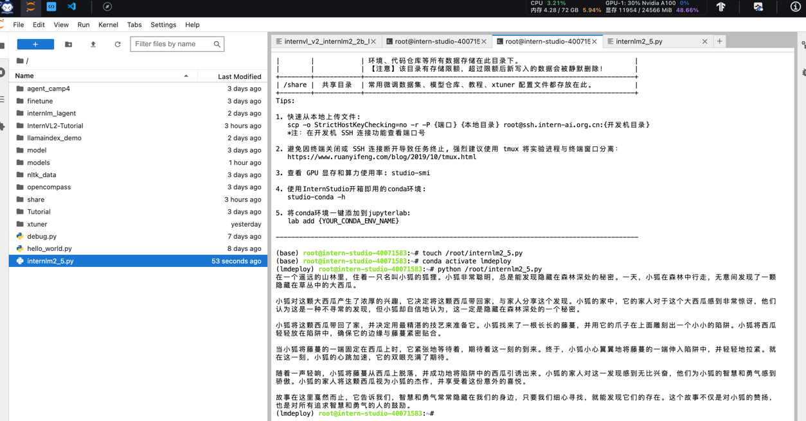

## **基础任务（完成此任务即完成闯关）**

- 使用结合W4A16量化与kv cache量化的`internlm2_5-1_8b-chat`模型封装本地API并与大模型进行一次对话，作业截图需包括显存占用情况与大模型回复，参考4.1 API开发，**请注意2.2.3节与4.1节应使用作业版本命令。**
- 使用Function call功能让大模型完成一次简单的"加"与"乘"函数调用，作业截图需包括大模型回复的工具调用情况，参考4.2 Function call(选做)

### 1. 使用结合W4A16量化与kv cache量化的`internlm2_5-1_8b-chat`模型
- 按照教程创建一个lmdeploy的conda环境，并安装相关包

         conda create -n lmdeploy  python=3.10 -y
         conda activate lmdeploy
         conda install pytorch==2.1.2 torchvision==0.16.2 torchaudio==2.1.2 pytorch-cuda=12.1 -c pytorch -c nvidia -y
         pip install timm==1.0.8 openai==1.40.3 lmdeploy[all]==0.5.3
         pip install datasets==2.19.2
- 直接用lmdeploy启动InternLM2_5-7b-chat，显存占用23GB，96.14%  
运行：         
  
      conda activate lmdeploy
      lmdeploy chat /root/models/internlm2_5-7b-chat
  
- 用W4A16量化+kv cache量化后启用API，显存占用11+GB，本地映射后可以打开api页面   
运行：

      #使用1.8B模型进行W4A16量化
      lmdeploy lite auto_awq \
         /root/models/internlm2_5-1_8b-chat \
        --calib-dataset 'ptb' \
        --calib-samples 128 \
        --calib-seqlen 2048 \
        --w-bits 4 \
        --w-group-size 128 \
        --batch-size 1 \
        --search-scale False \
        --work-dir /root/models/internlm2_5-1_8b-chat-w4a16-4bit
      
      #启用量化后的模型、设定kv cache占用和kv cache int4量化
      lmdeploy serve api_server \
          /root/models/internlm2_5-1_8b-chat-w4a16-4bit/ \
          --model-format awq \
          --quant-policy 4 \
          --cache-max-entry-count 0.4\
          --server-name 0.0.0.0 \
          --server-port 23333 \
          --tp 1

  
  
- 按教程新开终端新建python文件，运行调用api，结果如下：

- 启用api的终端显示完成了一次GET和POST
