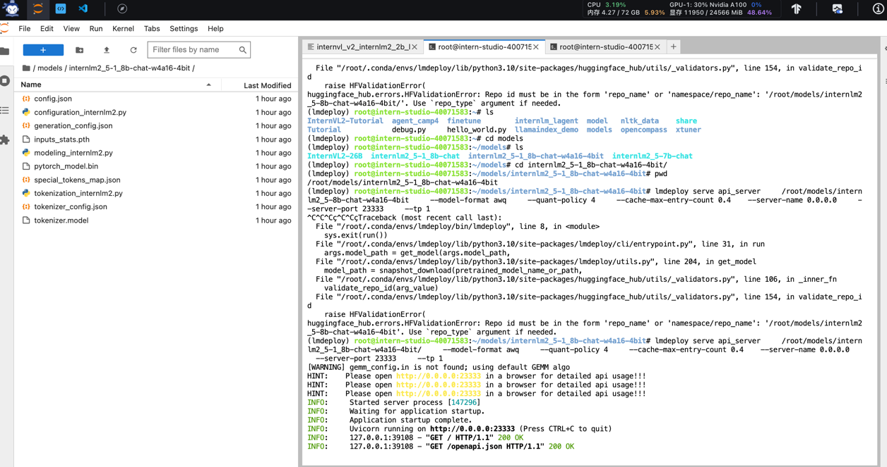

## **基础任务（完成此任务即完成闯关）**

- 使用结合W4A16量化与kv cache量化的`internlm2_5-1_8b-chat`模型封装本地API并与大模型进行一次对话，作业截图需包括显存占用情况与大模型回复，参考4.1 API开发，**请注意2.2.3节与4.1节应使用作业版本命令。**
- 使用Function call功能让大模型完成一次简单的"加"与"乘"函数调用，作业截图需包括大模型回复的工具调用情况，参考4.2 Function call(选做)

### 1. 使用结合W4A16量化与kv cache量化的`internlm2_5-1_8b-chat`模型
- 直接用lmdeploy启动InternLM2_5-7b-chat，显存占用23GB，96.14%

- 用W4A16量化+kv cache量化后启用API，显存占用11+GB，本地映射后可以打开api页面

- 按教程新开终端新建python文件，运行调用api，结果如下：

- 启用api的终端显示完成了一次GET和POST
