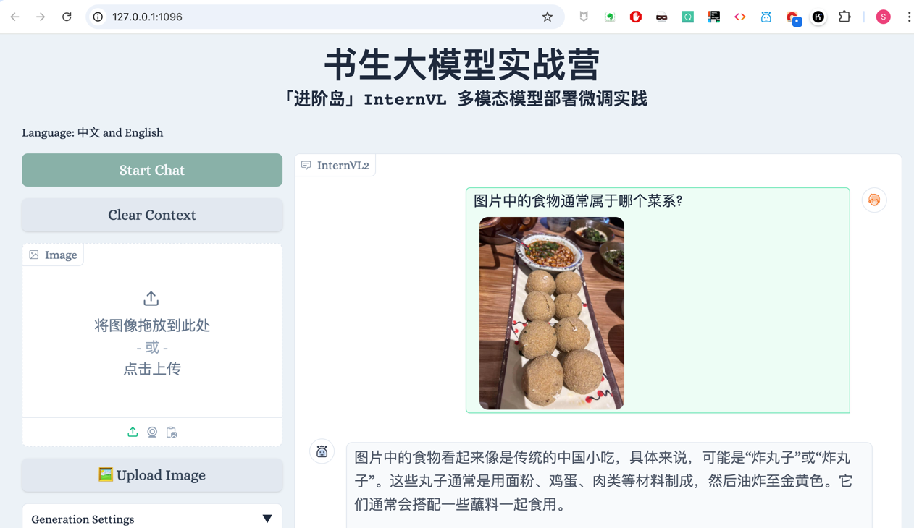
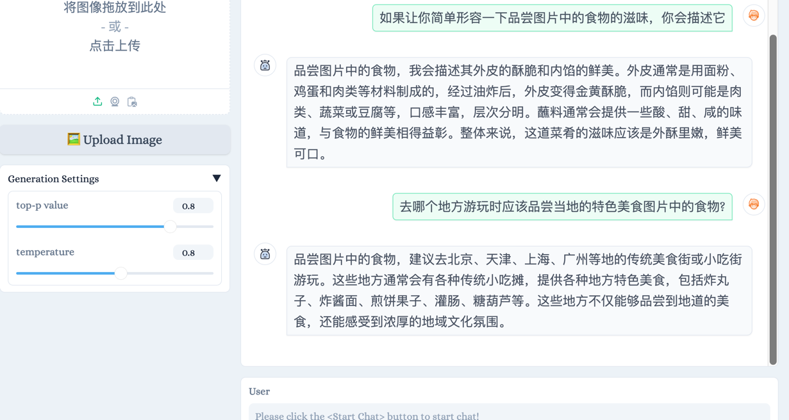
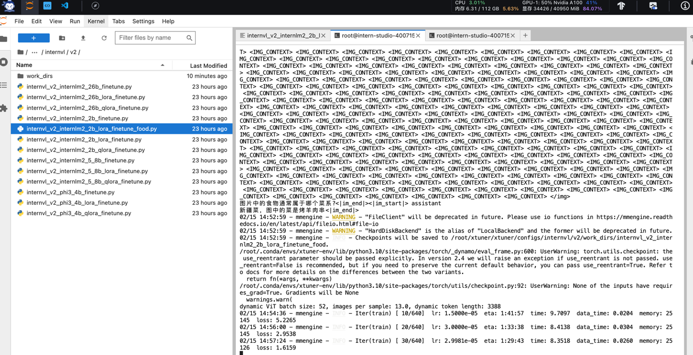

## **基础任务（完成此任务即完成闯关）**

- 理解多模态大模型的常见设计模式，可以大概讲出多模态大模型的工作原理。
- 了解InternVL2的设计模式，可以大概描述InternVL2的模型架构和训练流程。
- 了解LMDeploy部署多模态大模型的核心代码，并运行提供的gradio代码，在UI界面体验与InternVL2的对话。
- 了解XTuner，并利用给定数据集微调InternVL2-2B后，再次启动UI界面，体验模型美食鉴赏能力的变化。
- 将训练好的模型上传到 Hugging Face 或 ModelScope 上，模型名称包含 InternVL 关键词（优秀学员必做）

1. 多模态大模型
2. InternVL2的设计模式
3. UI界面体验与InternVL2的对话
选择了一个贵州小吃炸豆腐圆子，模型识别成普通炸丸子，

开始训练！

4. 用给定数据集微调InternVL2-2B后，再次启动UI界面，体验模型美食鉴赏能力的变化。
5. 将训练好的模型上传到 ModelScope 上，模型名称包含 InternVL 关键词