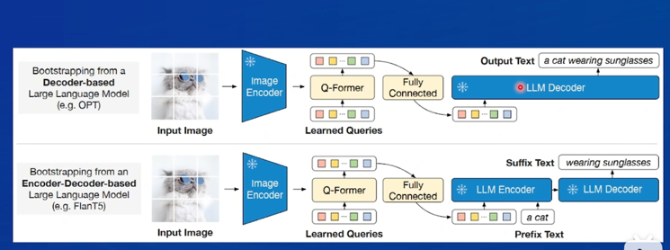
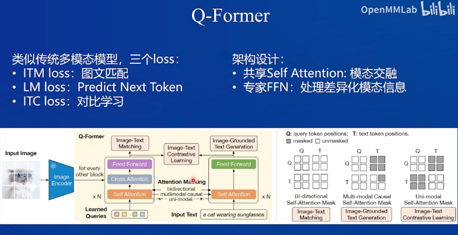
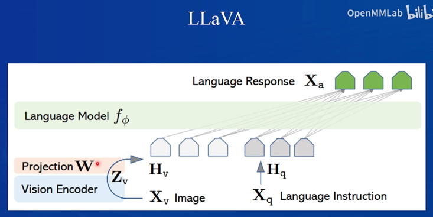
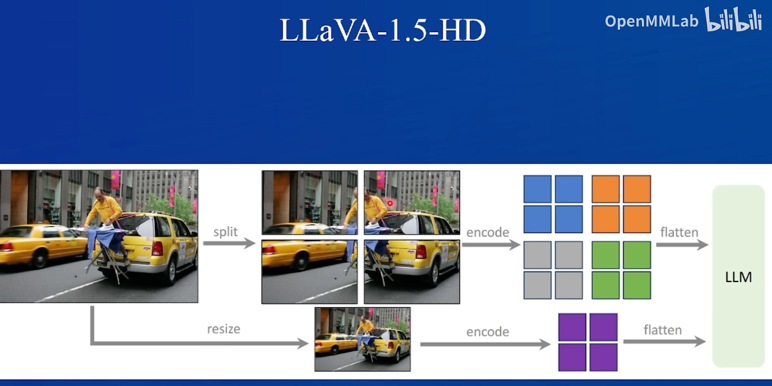
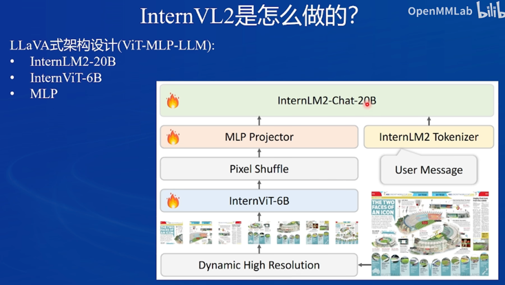
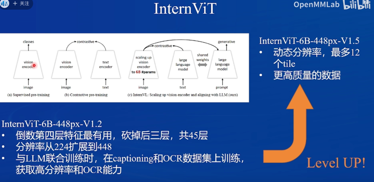
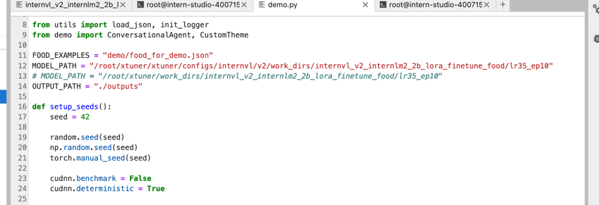
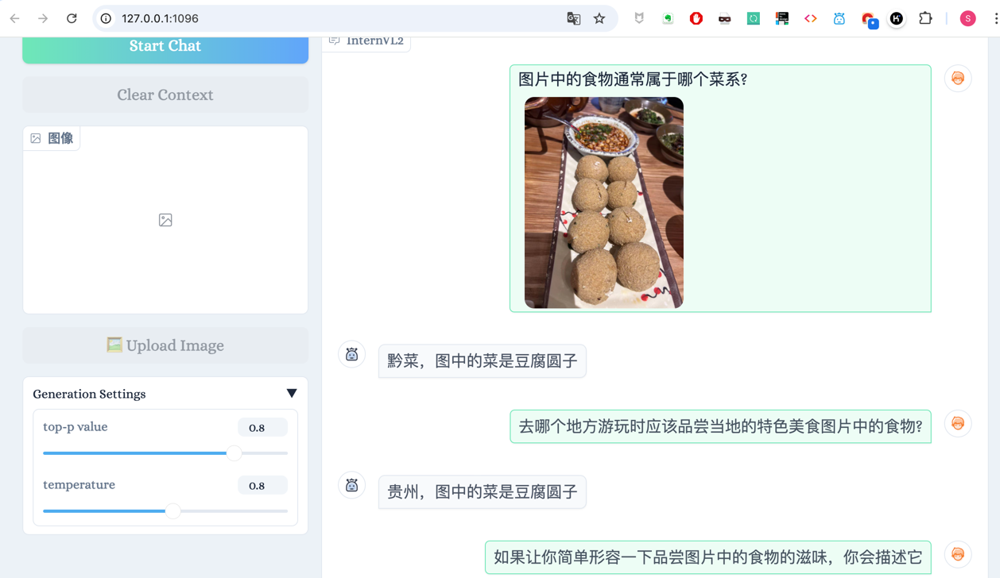

## **基础任务（完成此任务即完成闯关）**

- 理解多模态大模型的常见设计模式，可以大概讲出多模态大模型的工作原理。
- 了解InternVL2的设计模式，可以大概描述InternVL2的模型架构和训练流程。
- 了解LMDeploy部署多模态大模型的核心代码，并运行提供的gradio代码，在UI界面体验与InternVL2的对话。
- 了解XTuner，并利用给定数据集微调InternVL2-2B后，再次启动UI界面，体验模型美食鉴赏能力的变化。
- 将训练好的模型上传到 Hugging Face 或 ModelScope 上，模型名称包含 InternVL 关键词（优秀学员必做）

### 1. 多模态大模型的原理是对齐不同模态特征空间。常见的设计模式包括：
- BLIP2：将输入的图像编码，得到一些特征，然后通过一系列转换成文本特征输入LLM

- LLaVA:将图像切分为多个小块处理，同时将整张图片resize后传给LLM；后续的版本运用了动态分辨率，可以灵活处理不同比例的图片

### 2. InternVL2的设计模式
- InternVL2使用了LLaVA式的架构，基座大模型选用了InternLM2-20B，视觉编码器选用了自己训练的InternVIT-6B，对齐模块选用了MLP。
- 视觉编码器InternVIT-6B与一般通过监督学习、对比学习的VIT略有不同，一是视觉编码器有更多的参数，二是它在训练时直接和大语言模型的编码器做了对齐，在之后的生成任务中直接用这部分的LLM，效果会更好

### 3. UI界面体验与InternVL2的对话
选择了一个贵州小吃炸豆腐圆子，模型识别成普通炸丸子，

开始训练！

### 4. 用给定数据集微调InternVL2-2B后，再次启动UI界面，体验模型美食鉴赏能力的变化。
- 修改模型路径，启动网页应用

- 模型能很好地识别菜系菜名了，就是回答比较冷漠

### 5. 将训练好的模型上传到 ModelScope 上，模型名称包含 InternVL 关键词
- 已部署：
https://modelscope.cn/models/SutaLXY/InternVL_food/files