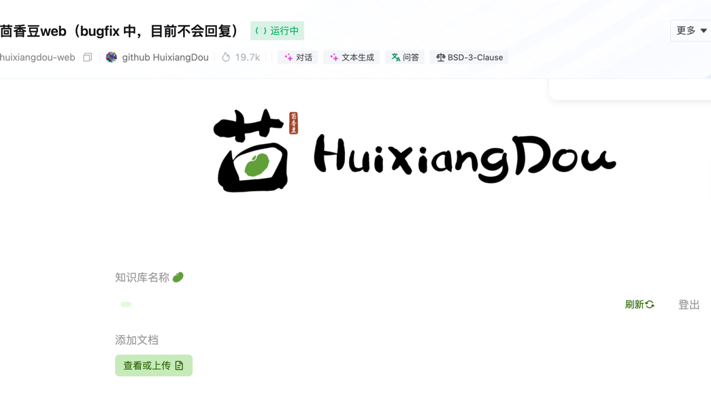
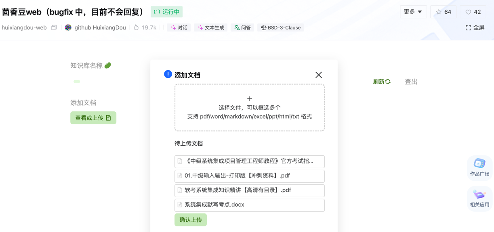
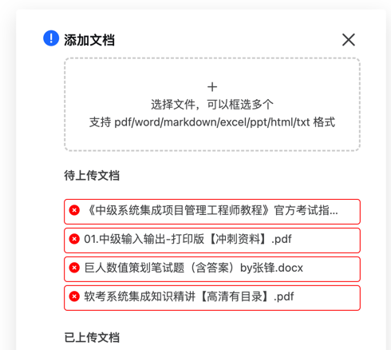
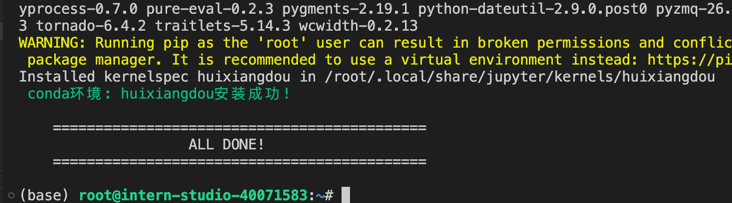
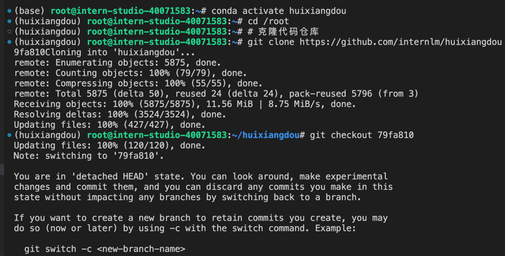
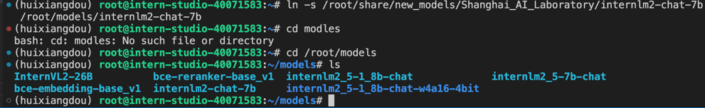
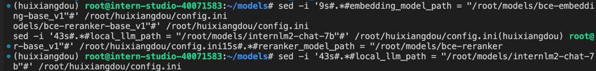
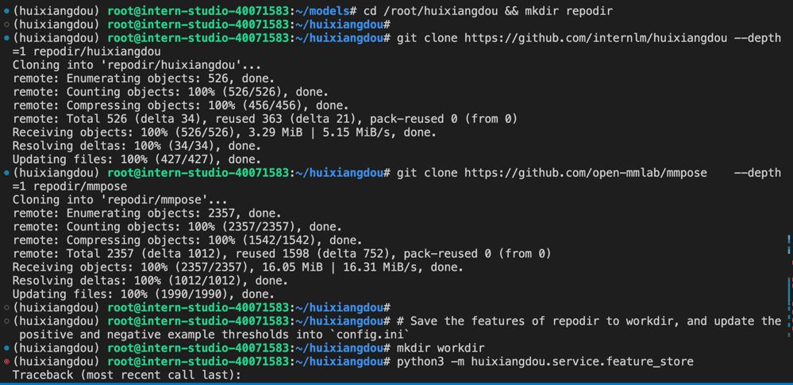
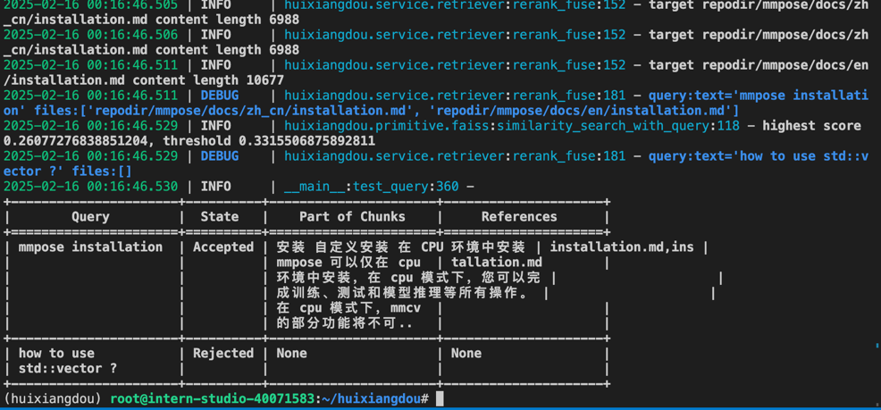

1. 创建web版茴香豆账号密码

2. 上传，但是都报错==，看起来只能本地部署了。

3. 创建茴香豆的专属环境，激活环境并从茴香豆仓库拉取代码到服务器，安装所需依赖

4. 复制大模型参数，在模型目录下查看。修改config参数，让茴香豆使用本地模型

5. 搭建知识库，执行 python3 -m huixiangdou.service.feature_store 时报错，是之前步骤遗漏了一部分的依赖库安装，于是补充安装下

6. 成功部署

