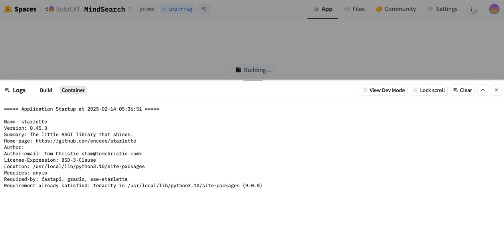
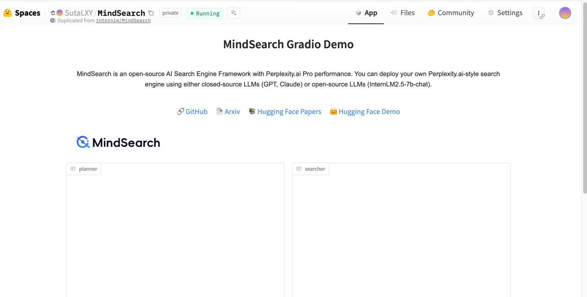
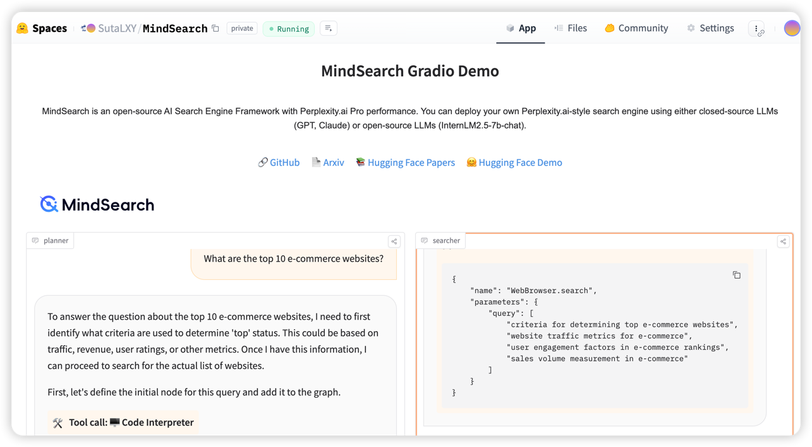
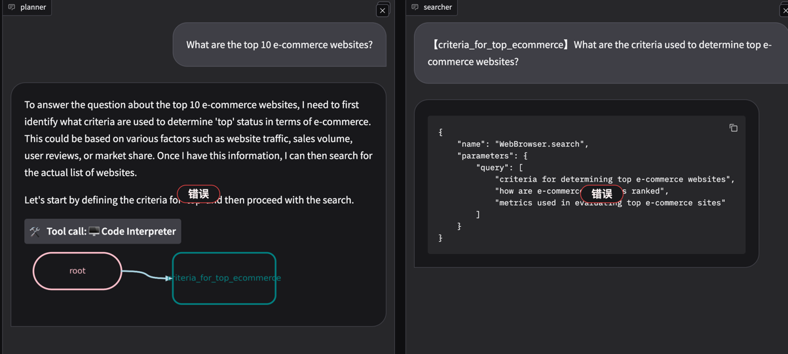
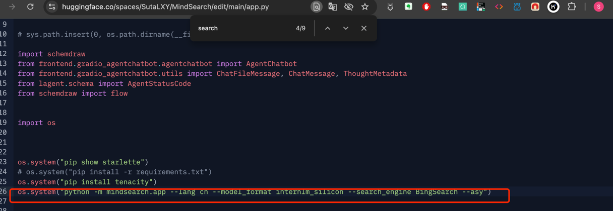
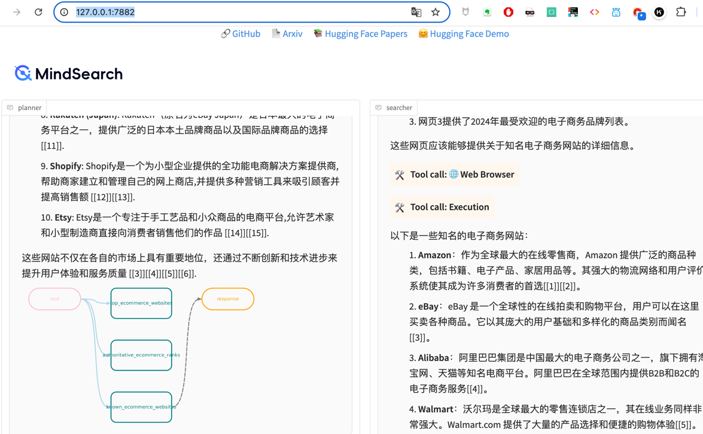

| 任务 | 描述 | 
| --- | --- | 
| 部署MindSearch到 hugging face Spaces上 | 在 [官方的MindSearch页面](https://huggingface.co/spaces/internlm/MindSearch) 复制Spaces应用到自己的Spaces下，Space 名称中需要包含 MindSearch 关键词，请在必要的步骤以及成功的对话测试结果当中 |
1. 复制了官方的Spaces应用，启动中

2. 部署完成

3. 提问，这里发现查询的时候报错。回到了官方的Spaces应用试用了下，也是同样的地方报错，看了下日志，应该是DuckDuckGoSearch的问题

4. 按照教程，尝试替换不同搜索引擎，包括：
   
        BingSearch 为 Bing 搜索引擎。
        BraveSearch 为 Brave 搜索引擎。
        GoogleSearch 为 Google Serper 搜索引擎。 
        TencentSearch 为 Tencent 搜索引擎。
   
5. 试试用不同搜索引擎均报错，发现除了DuckDuckGo外均需要密钥，试了申请部分密钥，替换后仍有不兼容问题。
6. 本地部署又试了下，发现用DuckDuckGo偶尔能成功，推测为DuckDuckGo的api限制了使用频率

        